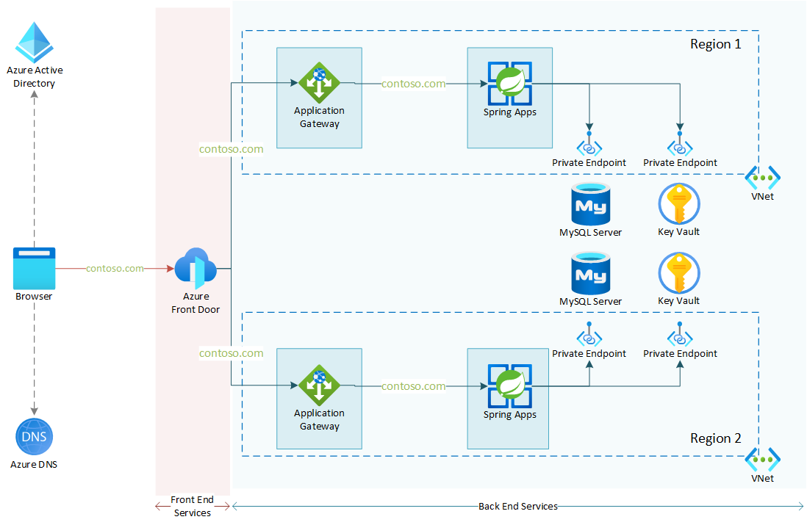

# Azure Spring Apps multi region reference architecture

This sample contains a Terraform template that deploys a working sample of the Azure architecture center reference architecture: [Multi region Azure Spring Apps reference architecture (coming up)](coming up). The reference architecture and sample show how to run an Azure Spring Apps workload in a multi region configuration. This allows for higher availability of the workload as well as global presence for the workload.



This sample also applies a proper reverse proxy configuration with [host name preservation](https://learn.microsoft.com/azure/architecture/best-practices/host-name-preservation). This means that cookies and AAD redirects will be working as expected.

## Features

This project framework provides the following features:

- Multi-region Spring Apps deployment with VNet integration
- Proper reverse proxy configuration for Application Gateway and Front Door with a custom domain
- Integration with Key Vault
- Integration with a MySQL database

## Getting Started

### Prerequisites

Before you begin, make sure you have the following available:

- Azure Subscription with Contributor access
- Azure Active Directory access
- pfx certificate for your custom domain (optional)
- GitHub Personal Access Token

> [NOTE!]
> There is also an option to install this infrastructure with a self-signed certificate. This certificate will be generated for you during the deployment. However, this setup should only be used in testing scenario's.
> Since Azure Front Door does not support self-signed certificates a host name override will take place, breaking some of the functionality of your backend applications. For production scenario's you should always apply [host name preservation](https://learn.microsoft.com/azure/architecture/best-practices/host-name-preservation).

To deploy the infrastructure, you can either make use of a locally installed environment, or you can make use of a pre-configured dev container.

When executing locally, make sure you have the following installed:

- Latest version of [Terraform](https://learn.hashicorp.com/tutorials/terraform/install-cli)
- Latest version of [AZ CLI](https://learn.microsoft.com/en-us/cli/azure/install-azure-cli)

When using the dev container, either make sure you have [GitHub Codespaces](https://docs.github.com/codespaces/overview) enabled in your GitHub organization (you need at least a GitHub Teams license for this), or you can start up the dev container locally with the [Visual Studio Code Remote Containers](https://code.visualstudio.com/docs/remote/containers) extension.

### Installation

To install this sample in your subscription:

### 1. Clone this repo

```bash
git clone https://github.com/Azure-Samples/azure-spring-apps-multi-region.git
cd azure-spring-apps-multi-region
```

### 2. Review the tfvars file

The [variables.tf](tf-deploy/variables.tf) and [myvars.tfvars](tf-deploy/myvars.tfvars) files in the tf-deploy directory contain the different variables you can configure. Update any values in the myvars.tfvars file to reflect the environment you would like to build. See below for an explanation of the different variables you can configure.

Some of the variables are secret values, it is better to create environment variables for these and pass them along through the command line instead of putting them in the tfvars file.

```bash
GIT_REPO_PASSWORD="GH_PAT_your_created"
CERT_PASSWORD='password_of_your_certificate'
```

### 3. Log in to your Azure environment

```bash
az login
```

### 4. Execute the deployment

```bash
cd tf-deploy

terraform init -upgrade
terraform plan -var-file="myvars.tfvars" -out=plan.tfplan var='git_repo_passwords=["$GIT_REPO_PASSWORD","$GIT_REPO_PASSWORD"]' var="cert_password=$CERT_PASSWORD"
terraform apply -auto-approve plan.tfplan
```

### 5. 1 extra manual step

In case you are deploying this sample with a certificate signed by a certificate authority, after the Terraform is deployed to your Azure environment, there is 1 extra manual step needed to verify the custom domain that is used in Azure Front Door.

If you check your Azure Front Door custom domain in the Azure Portal, you will notice the domain still needs to be verified. Terraform can only get you this far here. For verifying your custom domain, you can use a TXT record that you add to your DNS. Once you add this TXT record, the domain validity can be checked by Azure Front Door.

In the Azure Portal go to your Azure Front Door service > select `Custom Domain` > Select the `Pending` message in the custom domain entry. This will show a flyout with details on the TXT record you need to add in your DNS configuration for the verification.


Once the domain has been verified, you can connect to your application through your custom domain name.

In case you are using a self-signed certificate this extra step is not needed. You connect to your application using the DNS name of your Azure Front Door service.

### Terraform Variables

| param                  | Description                                                                                                                                                                                                                                                                                                          | Default value                          |
| ---------------------- | -------------------------------------------------------------------------------------------------------------------------------------------------------------------------------------------------------------------------------------------------------------------------------------------------------------------- | -------------------------------------- |
| `application_name`     | Optional. A name that will be prepended to all deployed resources.                                                                                                                                                                                                                                                   | asa-multiregion                        |
| `regions`              | Mandatory. An object representing the regions you wish to deploy to. See [region object]() below for the structure of this.                                                                                                                                                                                          |                                        |
| `git_repo_passwords`   | Mandatory. Azure Spring Apps can be configured with a config server that is linked to a git repository. For each region you want to deploy to this list of strings needs to contain the GitHub PAT for the git repository. You best pass this value through the command line. Don't put your PAT in the tfvars file! |                                        |
| `dns_name`             | Optional. The domain name you want to use for your application. This should be same domain name as you use in your certificate. The default value is only there to give you an idea of what this variable should look like. You should always change this value.                                                     | `sampleapp.randomval-java-openlab.com` |
| `cert_name`            | Optional. Name to use when your certificate is stored in the different Azure Services.                                                                                                                                                                                                                               | `openlabcertificate`                   |
| `shared_location`      | Optional. The location to deploy any shared resources to. This variable will be used to create a separate resource group for the Azure Front Door service. The service itself is global, but it still needs a local resource group.                                                                                  | `westeurope`                           |
| `use_self_signed_cert` | Optional. Set to false in case you want to use a properly signed domain certificate.                                                                                                                                                                                                                                 | `true`                                 |
| `cert_path`            | Optional. When using your own properly signed certificate. The path on disk towards this certificate. This certificate will be uploaded to your Key Vault.                                                                                                                                                           | empty string                           |
| `cert_password`        | Optional. The password for the private key of your certificate.                                                                                                                                                                                                                                                      | empty string                           |

#### Regions object

The variables make use of a regions object. This consists of the below parts:

| param               | Description                                                                                                                                                |
| ------------------- | ---------------------------------------------------------------------------------------------------------------------------------------------------------- |
| `location`          | Mandatory. The location for this region. For instance, `westeurope`.                                                                                       |
| `location-short`    | Mandatory. The short name of the region you want to deploy to. For instance `weu`. This short name will be appended to the name of all deployed resources. |
| `git_repo_uri`      | The uri to the git repository that holds the config data for this regions apps.                                                                            |
| `git_repo_branch`   | The branch of the git repository that holds the config data for this regions apps.                                                                         |
| `git_repo_username` | The username of the git repository that holds the config data for this regions apps.                                                                       |

### What you need to know about this setup

More info on how the terraform templates are build and how they operate can be found in the [docs](docs) folder of this repository. Best starting point is the [maintf.md](docs/maintf.md) file.

### Coming up

We are working on improving this sample. The ideas we have on improving:

- Create Bicep templates for the same setup (in progress)
- Make the database interchangeable for other types of databases (Cosmos DB as a first candidate)
- Make the application backend interchangeable. This multi-region setup with reverse proxies does not only apply to Azure Spring Apps, but also to other Azure PaaS services, like Azure App Service, Azure Kubernetes Service, ...
- Currently the apps in Azure Spring Apps are based on the Spring Petclinic sample, these apps should be better configurable.
- Include multi-zone support for Azure Spring Apps.
- Add explanation of each of the modules and how the template 'works'.

## Resources

- [Azure Architecture Center: Multi-region Azure Spring Apps reference architecture(coming up)](article coming up)
- [Preserve the original HTTP host name between a reverse proxy and its back-end web application](https://learn.microsoft.com/azure/architecture/best-practices/host-name-preservation)
