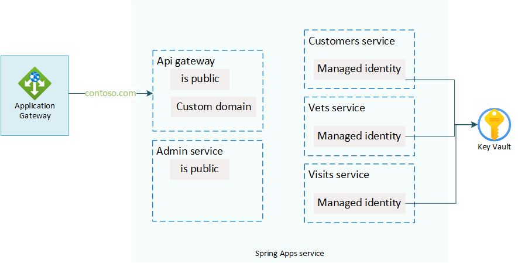

# Spring Apps Apps Module

(Yes that's apps twice, so the apps in your Spring Apps instance).



## App creation

For each app in the locals variable in the main.tf file an app gets created in the Azure Spring Apps service. Each app gets configured based on its configuration settings in that local variable. Whether or not it needs to be exposed within the virtual network and whether or not it needs a managed identity.

```terraform
resource "azurerm_spring_cloud_app" "app" {
  name                = var.app_name
  resource_group_name = var.resource_group
  service_name        = var.spring_cloud_service_name
  is_public = var.is_public

  dynamic identity {
    for_each = var.needs_identity == true ? [1] : []
    content {
        type = "SystemAssigned"
    }
  }
}
```

Each app also gets a default deployment slot assigned to it. This is needed since when creating spring apps through Terraform, the default slot is not added by default (the creation process through the portal or Azure CLI does add this default slot at creation time).

```terraform
resource "azurerm_spring_cloud_java_deployment" "deployment" {
  name                = "default"
  spring_cloud_app_id = azurerm_spring_cloud_app.app.id
  instance_count      = 1
  runtime_version     = "Java_8"

  quota {
    cpu    = "1"
    memory = "1Gi"
  }

  environment_variables = var.environment_variables
}

resource "azurerm_spring_cloud_active_deployment" "active-deployment" {
  spring_cloud_app_id = azurerm_spring_cloud_app.app.id
  deployment_name     = azurerm_spring_cloud_java_deployment.deployment.name
}
```

## Access policies

Each app that got created with a managed identity, will also get secret `Get` and `List` permissions in the Key Vault through its managed identity.

```terraform
data "azurerm_client_config" "current" {}

resource "azurerm_key_vault_access_policy" "access" {
  count = var.needs_identity ? 1 : 0
  key_vault_id = var.vault_id
  tenant_id    = data.azurerm_client_config.current.tenant_id
  object_id    = azurerm_spring_cloud_app.app.identity[0].principal_id

  secret_permissions = [
    "Get",
    "List"
  ]
}
```

## Custom domain

A custom domain also gets configured on the `api-gateway` app. The linking is done based on the certificate that got linked to the Spring Apps service based on the certificate name and thumbprint.

```terraform
resource "azurerm_spring_cloud_custom_domain" "custom_domain" {
  count = var.needs_custom_domain ? 1 : 0
  name                = var.dns_name
  spring_cloud_app_id = azurerm_spring_cloud_app.app.id
  certificate_name = var.cert_name
  thumbprint = var.thumbprint
}
```
