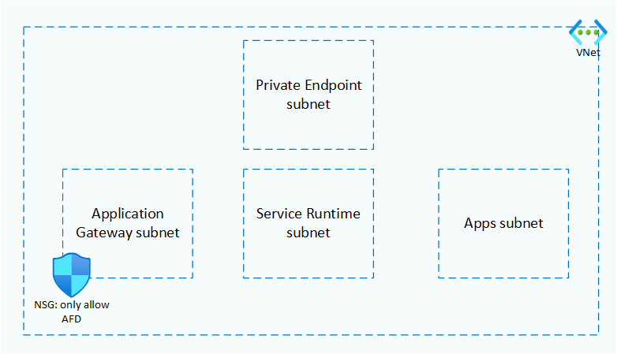

# network module

## Virtual network and subnets

The network module creates the virtual network all resources will be deployed in as well as all needed subnets:

- `svc_runtime_subnet`: Subnet used by Azure Spring Apps. This contains all relevant network resources Spring Apps needs to operate. You shouldn't add anything else to this subnet, it is exclusively used by Azure Spring Apps.
- `apps_subnet`: Subnet used by Azure Spring Apps. This is where your application code will be hosted. You shouldn't add anything else to this subnet, it is exclusively used by Azure Spring Apps.
- `appgw_subnet`: Subnet used by the Application Gateway. You shouldn't add anything else to this subnet, it is exclusively used by Application Gateway.
- `pe_subnet`: Subnet used for all private endpoints of other services. This is where the private endpoints for the Key Vault and the database will be created in.



```terraform
resource "azurerm_virtual_network" "vnet" {
  resource_group_name = var.resource_group
  name = var.vnet_name
  location = var.location
  address_space = var.vnet_address_space
}

resource "azurerm_subnet" "svc_runtime_subnet" {
  resource_group_name = var.resource_group
  virtual_network_name = azurerm_virtual_network.vnet.name
  address_prefixes = var.svc_subnet_address
  name = "service-runtime-subnet"
}

resource "azurerm_subnet" "apps_subnet" {
  resource_group_name = var.resource_group
  virtual_network_name = azurerm_virtual_network.vnet.name
  address_prefixes = var.apps_subnet_address
  name = "apps-subnet"
}

resource "azurerm_subnet" "appgw_subnet" {
  resource_group_name = var.resource_group
  virtual_network_name = azurerm_virtual_network.vnet.name
  address_prefixes = var.appgw_subnet_address
  name = "app-gw-subnet"
}

resource "azurerm_subnet" "pe_subnet" {
  resource_group_name = var.resource_group
  virtual_network_name = azurerm_virtual_network.vnet.name
  address_prefixes = var.pe_subnet_address
  name = "private-endpoints-subnet"
  private_endpoint_network_policies_enabled = true
}
```

## Role assignment

The network module also creates a `Owner` role assignment on the virtual network for the Azure Spring Apps service principal. This assignment is needed so Azure Spring Apps can control the network at creation time.

```terraform
resource "azurerm_role_assignment" "asa_vnet_role_assignment" {
  scope = azurerm_virtual_network.vnet.id
  role_definition_name = "Owner"
  principal_id = "d2531223-68f9-459e-b225-5592f90d145e"
}
```

## Network security group

The network module also locks down the Application Gateway subnet to only allow calls from Azure Front Door service. This is a first level of defense to only allow calls coming from Azure Front Door service. Also check out the configuration of Application Gateway itself, there the second level of defense gets implemented, by only allowing calls to Application Gateway from your specific Azure Front Door instance.

Both levels of defense are needed to properly lock down the traffic.

```terraform
resource "azurerm_network_security_group" "nsg-afd" {
  name                = "OnlyAllowAFD"
  location            = var.location
  resource_group_name = var.resource_group

  security_rule {
    name                       = "allow-afd"
    priority                   = 100
    direction                  = "Inbound"
    access                     = "Allow"
    protocol                   = "Tcp"
    source_port_range          = "*"
    destination_port_range     = "*"
    source_address_prefix      = "AzureFrontDoor.Backend"
    destination_address_prefix = "*"
  }
  security_rule {
    name                       = "allow-mgmt"
    priority                   = 200
    direction                  = "Inbound"
    access                     = "Allow"
    protocol                   = "Tcp"
    source_port_range          = "*"
    destination_port_range     = "65200-65535"
    source_address_prefix      = "GatewayManager"
    destination_address_prefix = "*"
  }

}

resource "azurerm_subnet_network_security_group_association" "appgw-nsg" {
  subnet_id                 = azurerm_subnet.appgw_subnet.id
  network_security_group_id = azurerm_network_security_group.nsg-afd.id
}
```
